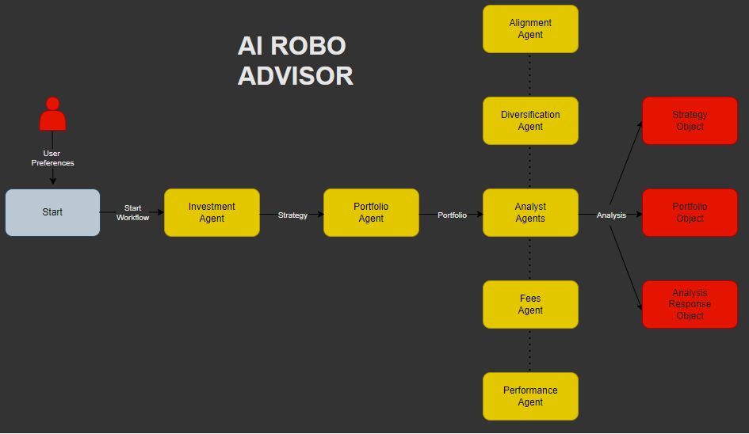
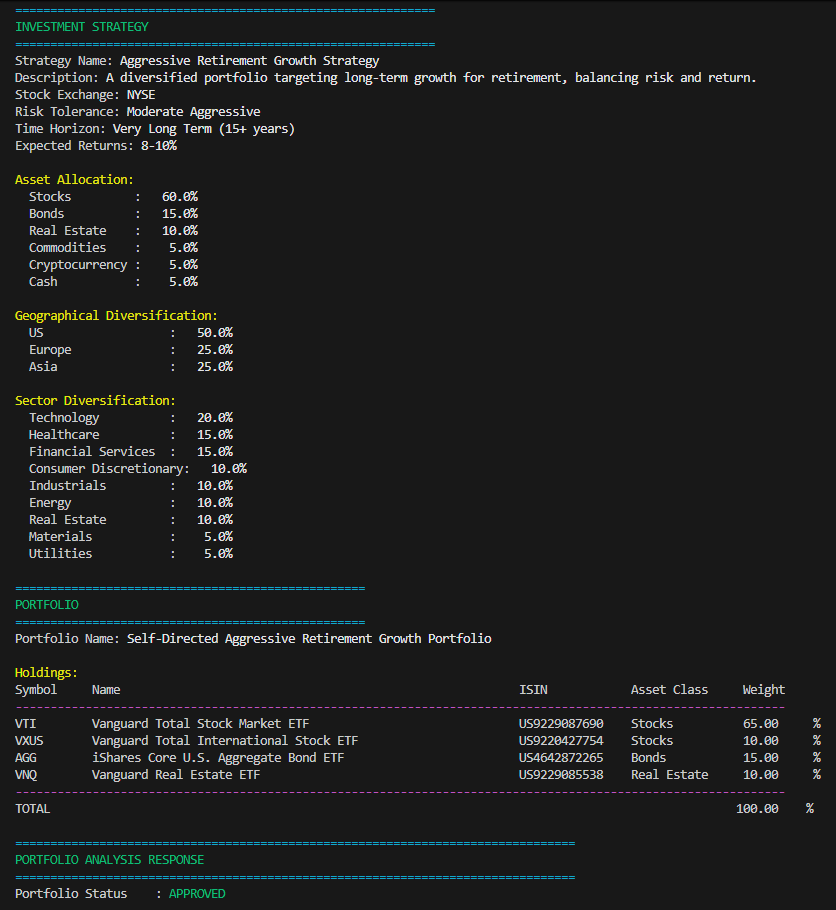
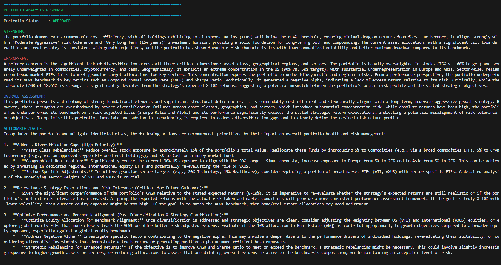

# 🤖 AI Robo Advisor

Welcome to your personal AI-powered investment assistant! This project aims to make professional-grade investment strategies, similar to those used by hedge funds, accessible to everyone through the power of AI.

This is the system workflow:

1. Investment Agent: collects user preferences via questionnaire and produces a structured Strategy.

2. Portfolio Agent: Translates the Strategy into a concrete ETF portfolio.

3. Analyst Agents:
    - Fees Agent: retrievesand analyze TER per holding.
    - Diversification Agent: compares and analyze portfolio vs strategy across asset class, geography, sector.
    - Alignment Agent: evaluates how holdings reflect risk tolerance, time horizon, expected returns embedded in the Strategy.
    - Performance Agent: computes CAGR, Annualized Volatility, Sharpe, Max Drawdown, Alpha, Beta and analyze if portfolio is performant.
    - Analysis Orchestrator: runs the above analyst agents and aggregates their outputs and provides a structured basis for downstream reporting.



> **Disclaimer:** This project is for educational and research purposes only. The information provided should not be considered financial advice. Investing in financial markets involves risk, and you should consult with a qualified professional before making any investment decisions.

## Key Features

*   **AI-Driven Analysis:** Leverages AI to analyze market data and suggest investment strategies.
*   **Portfolio Management:** Helps you build and track your investment portfolio.
*   **Educational Tool:** A great way to learn about both Langgraph and AI applications in finance.

## Table of Contents
- [Installation](#installation)
- [How to Run](#how-to-run)
- [Contributing](#contributing)
- [License](#license)

## 🚀 Getting Started

Ready to run the project on your local machine? Follow these steps.

Note: 
- Portfolios are created with a maximum of 4 ETFs, and the analysis is performed using 2 years of historical data. These limitations are in place to work within the constraints of the free Polygon.io API key. If you have a paid license, you can modify the code to increase these limits.
- The  

### Installation

1.  **Clone the repository:**
    ```bash
    git clone https://github.com/matvix90/ai-robo-advisor.git
    cd ai-robo-advisor
    ```

2.  **Create a virtual environment (recommended):**
    ```bash
    python3 -m venv venv
    source venv/bin/activate
    ```

3.  **Install the dependencies:**
    ```bash
    pip install -r requirements.txt
    ```

4. **Create a `.env` file for your API keys:**
    ```bash
    # Create .env file for your API keys (in the root directory)
    cp .env.example .env
    ```

5.  **Set up API Keys:**
    ```bash
    # For running LLMs
    OPENAI_API_KEY=your-openai-api-key

    # For getting financial data to power the robo advisor
    POLYGON_API_KEY=your-polygon-api-key
    ```

    **Important**: 
    - You must set at least one LLM API key (e.g. OPENAI_API_KEY, GOOGLE_API_KEY or ANTHROPIC_API_KEY) for the robo advisor to work.
    - You must set POLYGON_API_KEY for the robo advisor to work.

## How to Run

### ⌨️ Command Line Interface
You can run the AI Robo Advisor directly via terminal. This approach offers more granular control and is useful for automation, scripting, and integration purposes.



#### Run the AI Robo Advisor
```bash
python src/main.py
```

You can also specify a `--show-reasoning` flag to run the AI Robo Advisor seeing agents reasoning.

```bash
python src/main.py --show-reasoning
```

#### Example Analysis Response


## Contributing

Contributions are what make the open-source community such an amazing place to learn, inspire, and create. Any contributions you make are **greatly appreciated**.

If you have a suggestion that would make this better, please fork the repo and create a pull request. You can also simply open an issue with the tag  `enhancement`.

1.  Fork the Project
2.  Create your Feature Branch (`git checkout -b feature/NewFeature`)
3.  Commit your Changes (`git commit -m 'Add some NewFeature'`)
4.  Push to the Branch (`git push origin feature/NewFeature`)
5.  Open a Pull Request

### Features to Add 
1. Improve **agents** with new features and add more **llm** integrations
2. Add ***Financial API*** that allow to manage historical data of ETFs quoted on European market.
3. Improve **questionnaires** and **README.md** file.
4. Add **Docker** integrations
5. Add **Django** Backend and **React** Frontend to manage AI Workflow, Portfolio and Holdings.
6. Add **tests** for main functionality

## License

This project is distributed under the MIT License. See `LICENSE.txt` for more information.